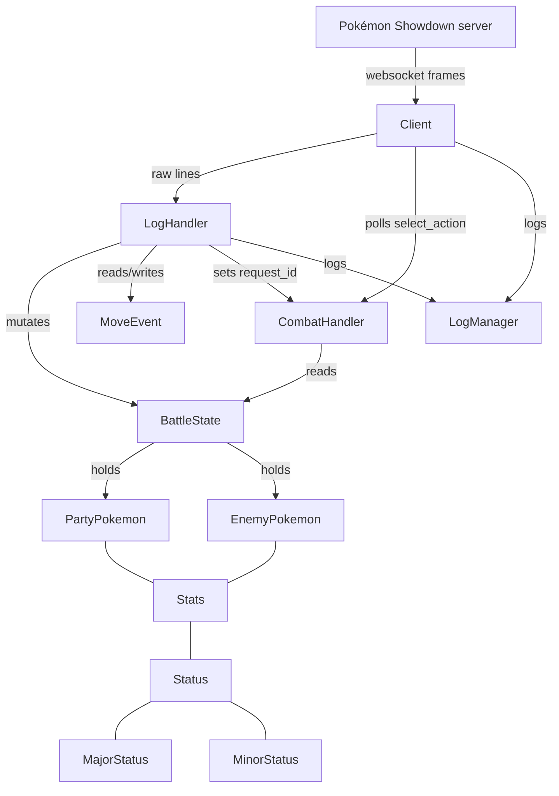

# Showdown SDK

An SDK for building [Pokémon Showdown](https://pokemonshowdown.com/) bots in
Python. `Showdown SDK` connects to a Showdown server over the websocket
protocol the server speaks, drives one or more battles, and exposes the
in-battle state that the protocol reveals so you can plug in your own decision
logic. The library handles the plumbing — connection, login, room tracking,
protocol parsing, action timeouts, and a structured battle-state model — while
you implement a single `select_action(battle_state)` hook to drive your AI.

The library is split into three layers:

1. **`classes.client`** — the network/protocol layer.
2. **`classes.combat`** — the in-battle world model and the pluggable AI.
3. **`classes.pokemon`** — the static Pokémon domain model (species,
   moves, stats, status conditions).

A separate `logger` module provides structured logging across the three layers.

## Architecture

### Network/protocol layer — `classes.client`

`client.client.Client` owns the websocket connection and orchestrates a battle
session. It is responsible for:

- connecting, logging in (`|/trn`), challenging / accepting challenges,
- running an asyncio `_receive_loop` that reads every protocol line,
- tracking the *current* room id (`room_id`) and the battle room we are actively
  driving (`active_battle_room`), so protocol traffic from other rooms (lobby,
  PMs, ...) is filtered out before reaching the combat model,
- awaiting a decision point (`client.request_id` becomes non-`None`) and
  calling `act()` to send a `/choose` back to the server,
- surfacing the final outcome of a battle via `wait_for_battle_end`, which
  resolves a `BattleResult` future when `|win|`/`|tie|` is parsed,
- an action-timeout watchdog (`start_action_timeout` / `_raise_on_action_timeout`)
  that fails the battle future if no `/choose` is sent in time — useful to
  recognise a parse gap when the server's `|request|` was not understood.

`client.parser.LogHandler` is the heart of the protocol layer. For every line
the receive loop hands it, `handle_line` does two things:

1. **`_on_line_for_history`** runs first and decorates the *in-progress*
   `MoveEvent` (`MoveEvent` is opened by `|move|` and fleshed out by the
   `|-damage|` / `|-supereffective|` / `|-status|` / `|-boost|` / ... lines that
   follow it). The event is flushed to `BattleState.move_history` at turn,
   switch, drag, faint, and `|move|` boundaries.
2. The body of `handle_line` then dispatches the line to a dedicated
   `_handle_*` method, each of which mutates `BattleState` (HP, status, boosts,
   side conditions, weather, switches, transforms, ...).

The parser therefore has a strict *record-before-mutate* invariant: the move
history entry for the current move is fully decorated *before* the targeted
handler changes HP/stage state, so the history reflects the pre-move snapshot
where that matters (e.g. damage deltas).

`client.dt` (`Format`, `FormatFlag`) and `client.utils` (`parse_formats`,
`parse_format_entry`, `print_formats`) describe the server's `|formats|`
advertisement. `Format.flag` properties (`can_search`, `can_challenge`,
`uses_random_team`, ...) are how the rest of the library reasons about what a
format allows.

### Combat layer — `classes.combat`

`combat.battle_state.BattleState` is the structured, in-memory view of the
battle. It holds:

- `team`: the player's own `PartyPokemon` list (revealed by `|request|`),
- `enemy_team`: six slots initialised as `Unknown` placeholders, filled in as
  the opponent switches Pokémon in via `witness_switch_in`,
- the active Pokémon ids (`curr_pokemon`, `curr_enemy_pokemon`),
- `available_moves` for the upcoming decision,
- `force_switch` (set when the active Pokémon fainted and the server is waiting
  for a switch),
- field state: `weather` and `side_conditions` (entry hazards per side),
- the append-only `move_history` of resolved `MoveEvent`s.

`BattleState` exposes `to_json()` for snapshots and `reset()` for reuse across
battles. Enemy move knowledge is accrued lazily through `witness_move` /
`EnemyPokemon.witness_move`.

`combat.move_history.MoveEvent` (and its helper `StatChange`) is the per-move
record the parser fills in. It captures outcome signals that a downstream agent
would otherwise have to re-derive from the raw log: hit/miss, super/not-very
effective, critical, damage and resulting HP, inflicted statuses, and stage
changes. Note the unit caveat in its docstring: HP for the player's own Pokémon
is absolute, while enemy HP is percentage-only (the server's HP Percentage Mod
hides absolute HP).

`combat.move_builder.MoveEventBuilder` owns the *construction* of a `MoveEvent`
across a cluster of consecutive protocol lines: `|move|` opens an event, the
`|-damage|`/`|-supereffective|`/`|-status|`/`|-boost|`/... lines that follow
decorate it, and turn/switch/drag/faint/`|move|` boundaries flush it into
`BattleState.move_history`. It also carries the `_ability_boost_pending`
cross-line flag so an ability-driven boost (e.g. Intimidate's `|-unboost|`) is
not mis-attributed to the move that triggered it. `LogHandler` holds one
instance and calls `on_line` *before* the per-message state mutation handlers,
which is what gives the parser its record-before-mutate ordering; the builder
is extracted into its own type so move-event construction is independently
testable without replaying a full log.

`combat.random.RandomMoveCombatHandler` is the seam between the `Client`'s
battle state and your AI. It is a **stateless policy**: it owns no battle state
and exposes one method:

- `select_action(battle_state)` — returns `("move"|"switch", slot)` and is
  what the client ultimately sends as `/choose`.

The `BattleState` it reads is owned by the `Client` (`client.battle_state`,
single source of truth: the parser mutates it, the AI reads it via this call).
The `request_id` is plumbing handled by the `Client`, not the policy. The built-in
policy is intentionally a weak baseline: random move selection with a small
switch chance, plus a forced-switch path. To plug in a real AI you replace this
handler (the `Client` is parameterised on it via the `combat_handler`
constructor argument) — the rest of the library never assumes
`RandomMoveCombatHandler` specifically, and only requires the same
`select_action(battle_state)` contract.

### Pokémon domain — `classes.pokemon`

`pokemon.pokemon.PartyPokemon` is the fully-revealed friendly Pokémon: id,
details, level, current/max HP, `Stats`, the move list, ability, item, and the
`Status` block. `EnemyPokemon` is the partial-information mirror: it starts
as `Unknown` and is progressively revealed (level/gender/shiny on switch-in,
moves via `witness_move`, ability/item via `|-ability|`/`|-item|` reveals). It
also models transform (Ditto / `temporary_moves`), Mimic-style disabled slots,
and `|-formechange|` relabelling. `available_moves` reconciles all of those
into the move set the enemy can actually use right now.

`pokemon.stats.Stats` is the six-stat block (atk/def/spa/spd/spe/max_hp).
`pokemon.stats.Status` is the volatile+non-volatile status container: stat-stage
boosts clamped to `[-6, +6]`, a single nullable `major` status, a `set` of
`MinorStatus`, and a few side-channels (`perish_count`, `must_recharge`).
`reset_on_switch` encodes the game's switch-out semantics (volatile state
clears, major status persists).

`MajorStatus` / `MinorStatus` are string enums keyed to the server's tokens
(`slp`/`psn`/`tox`/`par`/`brn`/`frz` for major; `confusion`/`Leech Seed`/...
for minor). `MajorStatus.from_server` gives a single parsing entry point and
fails loudly on unknown tokens.

`pokemon.moves.AvailableMove` is the per-turn move descriptor the server sends
inside `|request|` (name, id, PP, target, disabled). It is deliberately thin —
it is *the move I can press this turn*, nothing more.

### Logging — `python_showdown.logger`

`LogManager` owns three named loggers — `protocol`, `battle`, `errors` — that
the client and parser route through `extra={"room_id": ...}`. `BattleFileHandler`
uses that `room_id` extra to fan battle logs out to one file per `battle-*`
room, so concurrent battles don't interleave. `create_console_handler`,
`create_file_handler`, and `create_battle_file_handler` are the ready-made
handlers; `add_handler` / `remove_handler` accept either a logger name, a tuple
of loggers, or `None` (meaning all three).

### Module map

| Module | Role |
| --- | --- |
| `python_showdown.classes.client.client` | websocket session, room tracking, action timeout, battle future |
| `python_showdown.classes.client.parser` | protocol line dispatch + `BattleState` mutation |
| `python_showdown.classes.client.dt` | `Format` / `FormatFlag` definitions |
| `python_showdown.classes.client.utils` | `|formats|` parsing + pretty-printing |
| `python_showdown.classes.combat.battle_state` | structured in-battle world model |
| `python_showdown.classes.combat.move_history` | per-move outcome record |
| `python_showdown.classes.combat.move_builder` | builds a `MoveEvent` across a line cluster |
| `python_showdown.classes.combat.random` | baseline AI + the contract the client expects |
| `python_showdown.classes.pokemon.pokemon` | `PartyPokemon` / `EnemyPokemon` |
| `python_showdown.classes.pokemon.stats` | `Stats`, `Status`, `MajorStatus`, `MinorStatus` |
| `python_showdown.classes.pokemon.moves` | `AvailableMove` |
| `python_showdown.logger` | `LogManager`, per-room file handler, console/file helpers |
