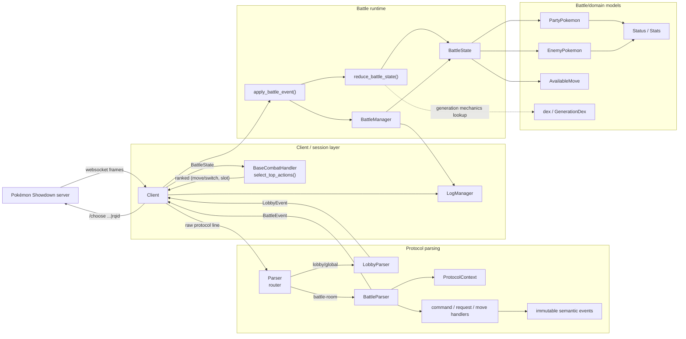
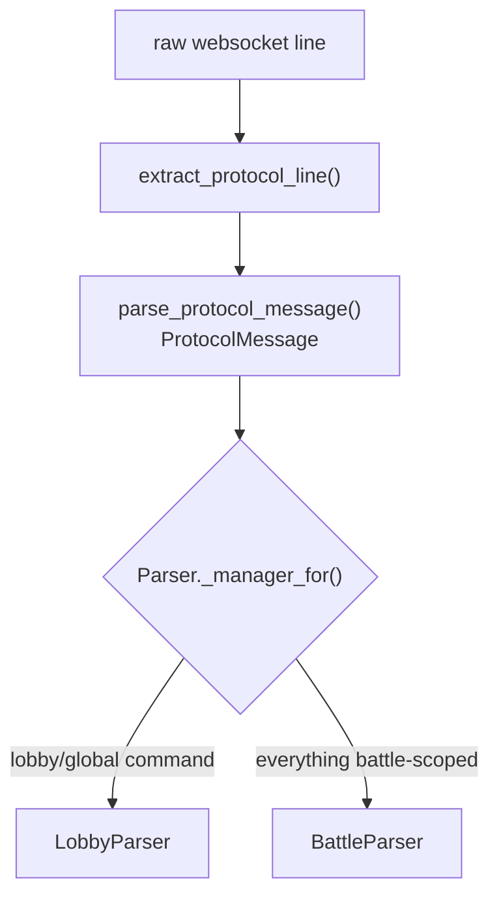
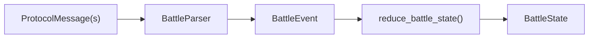
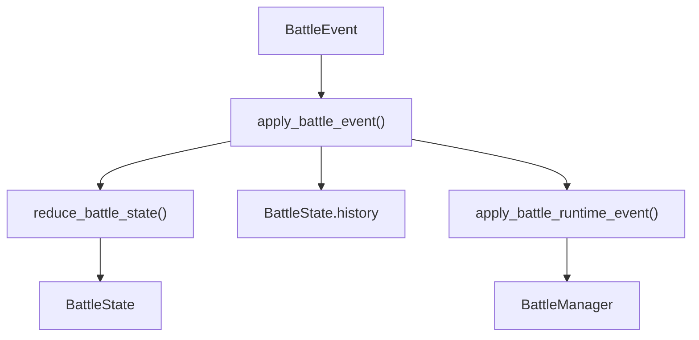
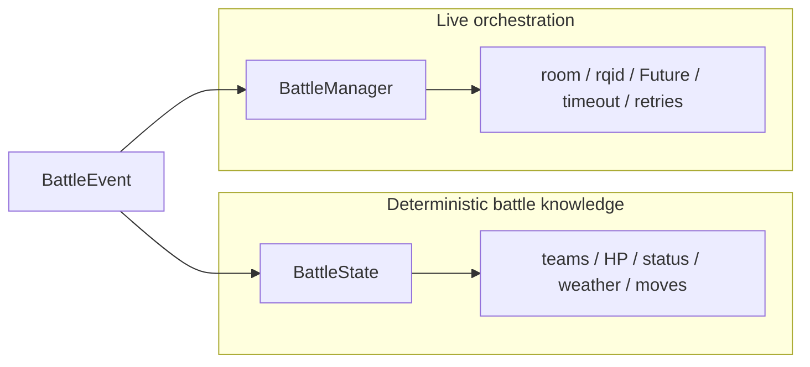
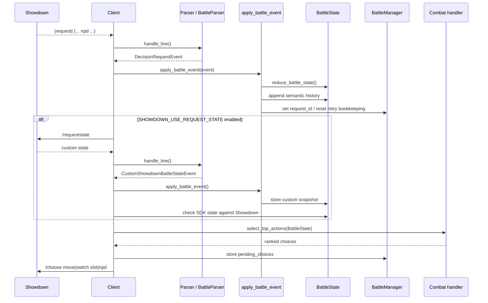
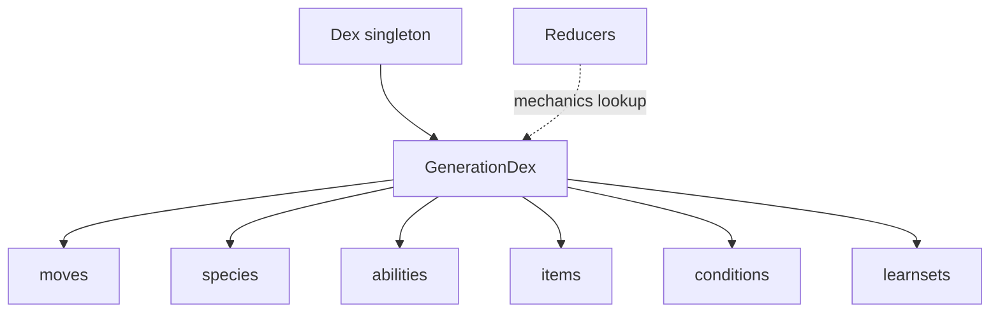

# Architecture

Showdown SDK is organized around a simple pipeline:

**Showdown protocol → semantic events → deterministic state reduction → runtime bookkeeping → combat policy → Showdown command**

The main design goal is to keep parsing, battle knowledge, live session mechanics, and decision logic separate.

## High-level architecture



## Main responsibilities

### `Client`: transport and orchestration

`showdown_sdk.classes.client.client.Client` owns the websocket-facing workflow.

It is responsible for:

- opening and closing the websocket connection,
- login and reconnect,
- challenge / accept / team validation commands,
- the receive loop,
- feeding raw protocol lines to `Parser`,
- applying emitted events,
- requesting the custom Showdown state when enabled,
- invoking the combat handler at decision points,
- sending `/choose`,
- coordinating battle completion and cleanup.

`Client` deliberately does **not** interpret battle mechanics itself. It delegates protocol interpretation to parsers and battle-state mutation to reducers.

## `Parser`: protocol router

`Parser` is the top-level protocol entry point.

A raw line is first normalized into a `ProtocolMessage`, then routed according to its command:



`Parser` also enforces room isolation. Battle messages from rooms other than the currently active battle are ignored and remembered as stale battle rooms.

This keeps the battle model from accidentally consuming lobby traffic or traffic from an auto-rejoined/old battle.

## `BattleParser`: syntax to semantic events

`BattleParser` converts Showdown's line-oriented protocol into immutable semantic `BattleEvent` objects.

It owns parser-local state only:

- raw protocol history,
- emitted event history,
- grouping position,
- action ids,
- `ProtocolContext`.

It does **not** mutate `BattleState` directly.

This separation is important because parsing and state transition are different operations:



### Grouped move parsing

A Showdown move is often represented by several consecutive protocol messages. A `|move|` line may be followed by damage, effectiveness, status, boost, ability, item, and other effect lines.

`BattleParser` buffers enough messages to identify a complete move group and passes the group to the move parser. The result is one or more semantic events that represent what happened, instead of exposing raw line adjacency to the rest of the SDK.

`ProtocolContext` carries information that must survive from one parsed message/group to another, such as generation-specific protocol state, known ability state, and Baton Pass context.

## Semantic events: the boundary between parsing and state

Classes under `classes.parser.events` are immutable descriptions of facts reported by Showdown.

Examples include:

- `MoveEvent`,
- `DamageEvent`,
- `PokemonSwitchEvent`,
- `AbilityEvent`,
- `ItemEvent`,
- `WeatherEvent`,
- `DecisionRequestEvent`,
- `BattleStartEvent`,
- `BattleEndEvent`.

The parser produces them; it does not decide their consequences.

That gives the SDK a useful architectural boundary:

**protocol-specific code ends at the event type.**

Everything after that can work with typed semantic information rather than raw Showdown strings.

## `apply_battle_event()`: canonical event application order

`apply_battle_event()` is the live bridge between semantic events and the rest of the SDK.

Its application order is:

1. reduce deterministic knowledge into `BattleState`,
2. append the event to `BattleState.history`,
3. apply runtime-only effects to `BattleManager`.



`CustomShowdownBattleStateEvent` is the exception to normal history recording: it updates the validation snapshot but is not appended to the normal semantic battle history.

## Reducers: semantic events to battle knowledge

`classes.parser.reducers` owns deterministic battle-state transitions.

`reduce_battle_state(battle_state, event)` explicitly dispatches every `BattleEvent` type. Missing reducer support raises instead of silently ignoring a new event type.

Reducers update things such as:

- HP,
- major/minor status,
- stat stages,
- active Pokémon,
- revealed enemy moves/items/abilities,
- transform/form changes,
- side conditions,
- weather,
- available actions,
- friendly-team request snapshots.

Generation-aware mechanics consult the shared `dex` reference data when necessary.

Reducers should stay deterministic: given the same initial `BattleState` and ordered event stream, they should produce the same battle state.

## `BattleManager`: live battle bookkeeping

`BattleManager` owns information that belongs to running a battle but is not itself Pokémon battle knowledge.

That includes:

- current battle room,
- battle completion future,
- request id,
- action timeout,
- retry state after rejected choices,
- ranked pending choices,
- team-preview requirement,
- turn-start snapshots,
- previous battle history/snapshots.

This distinction explains why `BattleState` and `BattleManager` are separate:



`BattleState` answers “what is true in the battle?”

`BattleManager` answers “what is the live SDK currently doing about this battle?”

## `BattleState`: single source of battle truth

`BattleState` is the structured world model consumed by a combat handler.

It contains:

- the friendly team,
- partially known enemy team,
- active Pokémon,
- friendly active volatile status and current ability,
- legal moves from the latest request,
- forced-switch state,
- weather and side conditions,
- battle format metadata,
- semantic event history.

The parser does not own a second battle model. `BattleParser.battle_state` is only an accessor to `BattleManager.battle_state`.

This avoids synchronization between multiple independently mutable representations.

## Friendly vs enemy Pokémon models

The SDK intentionally models the two sides differently because Showdown reveals different information.

### `PartyPokemon`

The friendly team is authoritative data from `|request|`. On each decision request, reducers rebuild the list of `PartyPokemon` objects from that snapshot.

It contains fully known data such as stats, HP, moves, base ability, and item.

### `EnemyPokemon`

Enemy information is observational and incremental.

An `EnemyPokemon` begins only when the species is witnessed and accumulates information from semantic events:

- observed moves,
- HP percentage,
- statuses,
- revealed item,
- revealed ability,
- transforms,
- temporary copied moves,
- forme changes.

Unknown enemy slots are represented explicitly with `Unknown.VALUE`.

## Combat handler: policy boundary

`BaseCombatHandler` defines the decision contract:

```python
select_top_actions(battle_state: BattleState) -> list[tuple[str, int]]
```

The policy receives the SDK's `BattleState` and returns legal actions ranked best-first.

The handler is expected to be stateless with respect to battle truth. It may contain the AI/model itself, but it should not maintain a competing copy of the battle.

The client stores the returned ranking in `BattleManager.pending_choices`. If Showdown rejects the first choice, the next ranked choice can be tried for the same request id without recomputing the policy.

Team preview uses the separate `select_team_order()` hook.

## Decision flow

The complete decision path is:



The optional custom Showdown snapshot is validation data, not an alternative source of battle truth for the combat handler.

## Static Dex data

`showdown_sdk.models.dex.dex` is a shared singleton providing generation-aware reference data.



`Dex`, `GenerationDex`, and `DexTable` cache data lazily. They are reference data and do not belong to a particular `Client` or battle.

## Dependency direction

The intended dependency direction is roughly:

```text
Client
 ├─ Parser
 │   ├─ protocol parsing
 │   ├─ handlers
 │   └─ immutable events
 ├─ BattleManager
 │   └─ BattleState
 └─ CombatHandler

events
 ├─> reducers ─> BattleState
 └─> runtime application ─> BattleManager

reducers ─> Pokémon models
reducers ─> dex
```

A useful rule when adding code is:

- raw Showdown syntax belongs in protocol parsing/handlers,
- “what happened” belongs in an event,
- deterministic battle consequences belong in reducers,
- networking/request/future/timeout concerns belong in `Client` or `BattleManager`,
- decision-making belongs in a combat handler,
- reusable Pokémon/reference structures belong in `models`.

Keeping that direction prevents protocol details from leaking into AI code and prevents networking concerns from leaking into the battle model.
