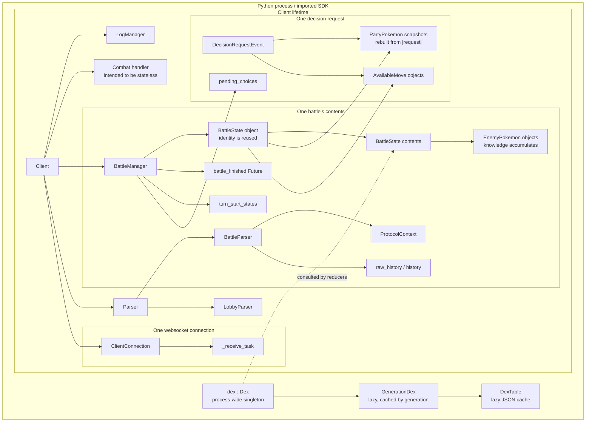
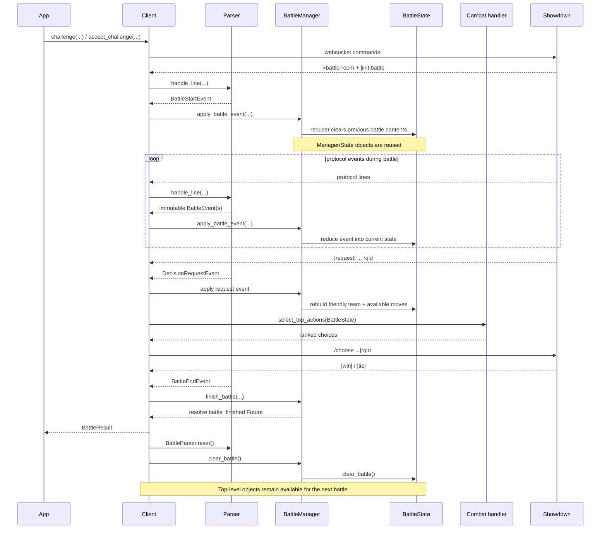

# Object lifetimes

This document describes how long the main SDK objects live, what owns them, and which objects are **reused** versus **recreated**.

The important distinction is that several top-level objects are client-scoped while the data inside them is battle-scoped. In particular, `Client`, `BattleManager`, `Parser`, and `BattleState` normally keep the same Python object identity across multiple battles; their battle-specific contents are cleared between battles.

## Lifetime overview

## Client-scoped objects

### `Client`

A `Client` is the long-lived orchestration object for one Showdown identity/session. Constructing it also constructs its default `LogManager`, combat handler, `BattleManager`, and `Parser`.

A client may survive multiple websocket connections and multiple battles. `close()` destroys the current connection/task state, but it does not destroy the `Client` itself. `ensure_connected()` can create a new websocket and receive task and then log the same client back in.

The following state is therefore client-scoped rather than battle-scoped:

- login/session identity such as `username`,
- the `formats` cache,
- the configured `LogManager`,
- the configured combat handler,
- the `BattleManager` object,
- the `Parser` object.

Challenge and team-validation futures are shorter-lived operation state stored on the client only while those operations are pending.

### `BattleManager`

`BattleManager` is created once by `Client` and reused. It owns the live battle runtime bookkeeping:

- room id and room readiness,
- the current request id and retry state,
- ranked pending choices,
- the action-timeout task,
- the battle completion future,
- turn-start snapshots,
- the `BattleState` object.

The manager itself is not replaced after a battle. `clear_battle()` clears the fields belonging to the current battle, while `clear_battle_tracking()` releases the completion future/timing state after the battle is finished.

`last_battle_history` and `last_battle_turn_states` deliberately outlive the battle reset. They retain copies of the most recently completed or abandoned battle data until another battle overwrites them.

### `Parser`

`Parser` is also created once per `Client`. It owns one `BattleParser` and one `LobbyParser` and routes each parsed protocol message to the appropriate side.

The `Parser` object persists across battles. Its `BattleParser` object also normally persists by identity, but `BattleParser.reset()` replaces its battle-local context and clears its accumulated messages/events.

### Combat handler

The combat handler is owned by the client and normally lives as long as the client. The handler contract is intentionally stateless with respect to battle state: the current `BattleState` is passed into `select_top_actions(...)` when a decision is needed.

A policy may therefore cache model weights or other application-level resources for its whole client lifetime, but battle truth should remain in `BattleState`, not in a second shadow state owned by the policy.

## Connection-scoped objects

`ClientConnection` and `_receive_task` belong to one websocket connection.

`connect()` creates both. `close()` clears and closes them. A reconnect creates new objects while keeping the surrounding `Client`, `Parser`, `BattleManager`, combat handler, and logger.

This means connection lifetime and battle lifetime are independent: a normal completed battle leaves the websocket alive, while an aborted or failed battle may close the websocket before its battle state is cleared.

## Battle-scoped state

### `BattleState`

There is one `BattleState` object owned by the `BattleManager`. Its **identity is client-scoped**, but almost all of its contents are battle-scoped.

`BattleStartEvent` causes the reducer to call `BattleState.clear_battle()`, and final cleanup after `wait_for_battle_end()` clears it again through `BattleManager.clear_battle()`.

Battle-scoped contents include:

- generation, game type, and tier,
- player id,
- friendly and enemy teams,
- active Pokémon ids,
- current active-player volatile status/ability state,
- available moves and forced-switch state,
- weather and side conditions,
- semantic event history,
- the most recent custom Showdown state snapshot.

Keeping the object identity stable allows callers and the combat handler to keep a reference to `manager.battle_state` without that reference becoming stale between battles. They must still treat its contents as belonging only to the currently active battle.

### `BattleParser` state and `ProtocolContext`

`BattleParser` stores battle-local parsing state:

- raw `ProtocolMessage` history,
- semantic event history,
- the next unparsed-message index,
- action ids,
- `ProtocolContext`,
- the current battle-room context.

`ProtocolContext` exists to carry parser knowledge that is needed across protocol lines, such as the generation, active/known ability states, and pending Baton Pass information.

`BattleParser.reset()` clears the histories/counters and constructs a fresh `ProtocolContext`. The outer `BattleParser` object remains the same.

### Semantic `BattleEvent` objects

Battle events are immutable facts produced by the parser. Their normal lifetime is the battle history.

For a live battle, the same event flows through this sequence:

1. `BattleParser` creates it and stores it in parser history.
2. `Client` passes it to `apply_battle_event(...)`.
3. The event is reduced into `BattleState`.
4. The event is appended to `BattleState.history`.
5. Runtime-only effects are applied to `BattleManager`.

At battle end, `BattleManager.finish_battle()` copies `BattleState.history` into `last_battle_history`, so those event objects can remain reachable after the parser and state histories are cleared.

## Pokémon object lifetimes

### `PartyPokemon`: request-snapshot lifetime

Friendly Pokémon are unusual: their Python object identity is generally **decision-request scoped**, not battle scoped.

Each `DecisionRequestEvent` rebuilds the friendly team from the server's `|request|` payload and replaces `BattleState.team` with a new list of `PartyPokemon` objects. Between requests, reducers may update those objects as battle events arrive, but the next request rehydrates them from the new server snapshot.

Consequences:

- do not keep a long-lived reference to a particular `PartyPokemon` instance,
- find the current object through `BattleState` when needed,
- treat `PartyPokemon` as the latest server snapshot for the friendly team.

The current active Pokémon's volatile status and temporary ability/transform state are intentionally stored separately on `BattleState` (`curr_pokemon_status`, `curr_pokemon_ability`, `curr_pokemon_transformed`) because those values have different switch/reset semantics from the request snapshot.

### `EnemyPokemon`: battle lifetime

Enemy Pokémon are learned incrementally, so their objects are battle-scoped and generally persist once discovered.

A battle starts with six `Unknown` enemy placeholders. On the first observed switch-in of a Pokémon, one placeholder is replaced with a real `EnemyPokemon`. The object then accumulates knowledge such as witnessed moves, item, ability, HP percentage, and status until the battle is cleared.

Some fields are only switch-scoped. `reset_on_switch_in()` clears volatile state such as transform, temporary/disabled moves, forme state, and switch-resettable status while preserving persistent knowledge such as the learned base moveset and revealed base ability/item information.

## Decision/request-scoped objects

A `DecisionRequestEvent` represents one Showdown decision snapshot. Applying it updates both `BattleState` and `BattleManager` request bookkeeping.

The following data should be considered tied to that request id:

- `AvailableMove` objects,
- the rebuilt `PartyPokemon` snapshots,
- `BattleManager.request_id`,
- `pending_choices` and `pending_choices_rqid`,
- the optional custom Showdown state requested for consistency checking.

The combat handler ranks legal actions once for the request. If Showdown rejects the first choice, `BattleManager` consumes the remaining `pending_choices` for the same request id instead of asking the policy to recompute against potentially unchanged state.

Once the request is consumed or superseded, those choices and request-local move availability are no longer authoritative.

## Process-scoped reference data: `dex`

`showdown_sdk.models.dex.dex` is a process-wide `Dex` singleton.

It lazily creates and caches:

- one `GenerationDex` per accessed generation,
- one `DexTable` per accessed dataset,
- decoded JSON data on first table access,
- some derived generation-specific caches such as charge moves.

This data is shared across clients and battles. `refresh()` drops cached data, but the singleton `Dex` object itself remains alive.

Reducers consult `dex` for generation-specific mechanics; `dex` is reference data, never battle state.

## One battle from creation to cleanup

